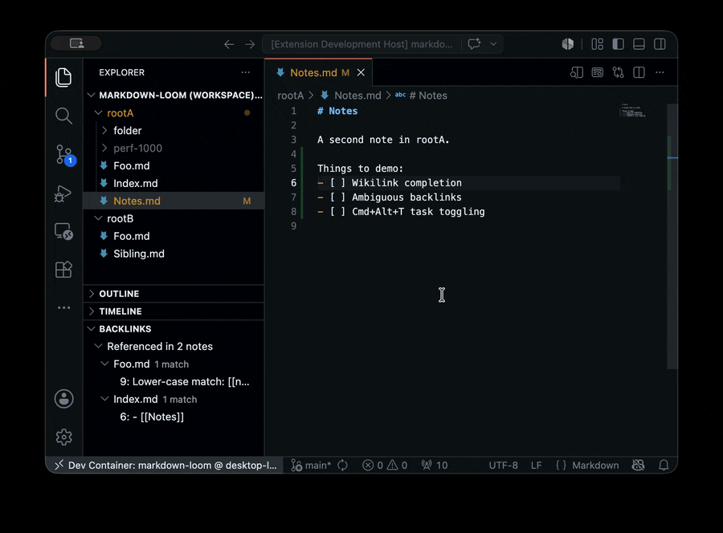

# markdown-loom

A VS Code extension for plain-markdown note taking. Wikilinks, backlinks, and
Obsidian-Tasks-compatible checkboxes - no proprietary formats, no databases,
just `.md` files.

See [docs/SPEC.md](./docs/SPEC.md) for the full specification.



## Status

Phase 1 (MVP):

- [x] Wiki-style linking (`[[Note]]`, `[[folder/Note]]`)
- [x] Backlinks panel
- [x] Basic task support (toggle + done date)

Phase 2 features (task queries, quick task entry) are planned after MVP.

## Features

### Backlinks panel

- Open the **Backlinks** view in the Explorer to see notes that link to
  the active markdown file, grouped by source file with line previews.
- The panel refreshes when you switch files or save changes.
- **Filename collisions surface here.** When a bare `[[Foo]]` matches
  multiple notes (e.g., two `Foo.md` files in different folders or
  workspace roots), navigation picks one winner via the same-folder
  tiebreaker, but the link registers as a backlink on *every*
  candidate. Non-winner entries are flagged "ambiguous" with a ⚠ icon
  so you can spot and resolve the collision. Folder-qualified links
  like `[[subdir/Foo]]` stay 1:1.

### Tasks

- Place the cursor on a list item and press `Ctrl`+`Alt`+`T`
  (`Cmd`+`Alt`+`T` on macOS) to toggle the checkbox between `[ ]` and
  `[x]`.
- Completing a task auto-appends `✅ YYYY-MM-DD` (configurable via
  `markdownLoom.autoAddDoneDate`).
- All other emoji metadata (⏳, 📅, 🔁, ⏫, 🔼, 🔽) and `#tags` are
  preserved exactly when toggling.

### Wiki-style linking

- Type `[[` to autocomplete from all `.md` files in your workspace
  (every folder, if you use a multi-root workspace).
- Ctrl/Cmd+Click a `[[link]]` to jump to the target file (case-insensitive).
- The Markdown preview pane renders `[[links]]` as clickable links.
- Clicking a link to a file that doesn't exist offers to create it.
- Wikilink patterns inside fenced code blocks are ignored.

## Settings

| Setting | Default | Description |
| --- | --- | --- |
| `markdownLoom.wikiLinkStyle` | `name` | How `[[` completion inserts links: `name`, `relative`, or `absolute`. |
| `markdownLoom.taskDateFormat` | `YYYY-MM-DD` | Date format used when stamping task dates. |
| `markdownLoom.queryLimitDefault` | `50` | Default maximum results for a `tasks` query block (Phase 2). |
| `markdownLoom.autoAddDoneDate` | `true` | Automatically append `✅ YYYY-MM-DD` when toggling a task done. |

## Keyboard shortcuts

Defaults; override via `Preferences: Open Keyboard Shortcuts`.

| Command | Default | When |
| --- | --- | --- |
| `Markdown Loom: Open Wiki Link` | `Ctrl`/`Cmd`+Click | On a `[[link]]` in a markdown file |
| `Markdown Loom: Toggle Task` | `Ctrl`+`Alt`+`T` / `Cmd`+`Alt`+`T` | In a markdown file |

Toggling a task to done appends `✅ YYYY-MM-DD` (today) to the line if
`markdownLoom.autoAddDoneDate` is true. Toggling back to open removes
that auto-stamped done date and leaves any other emoji or tags alone.

## Limitations

- Untitled (unsaved) buffers are not indexed for completion or backlinks.
- `[[link]]` resolution and backlink search use case-insensitive basename
  matching; if multiple notes share a basename, completion qualifies them
  with a `folder/` prefix.
- The extension activates only for the `markdown` language.

## Devcontainer

This repo includes a VS Code devcontainer for a consistent Node.js
environment.

1. Install Docker + the VS Code Dev Containers extension.
2. Open this folder in VS Code.
3. Run `Dev Containers: Reopen in Container`.

## Development

```sh
npm install
npm run lint
npm run compile
npm test
npm run package   # produces a .vsix
```

## License and attribution

Markdown Loom is released under the [MIT License](./LICENSE).

Task-line parsing logic is adapted from
[obsidian-tasks-group/obsidian-tasks](https://github.com/obsidian-tasks-group/obsidian-tasks)
(MIT). The required attribution is included in
[`LICENSES/obsidian-tasks.MIT.txt`](./LICENSES/obsidian-tasks.MIT.txt).
